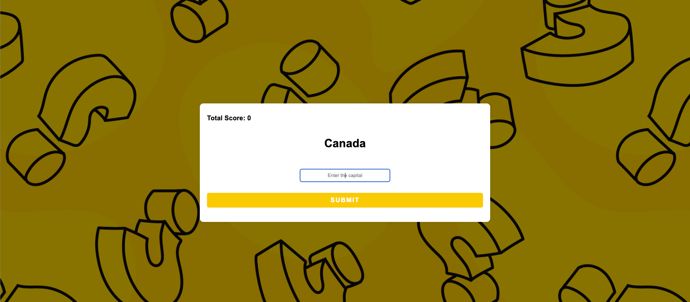

# Capital City Quiz

This project is a simple quiz application where users answer questions about capitals of different countries. It stores quiz data in a PostgreSQL database and renders dynamic questions on a webpage. The goal of this project was to gain experience with server-side rendering, database integration, and handling form submissions.



## Features
- Randomly displays questions about country capitals.
- Users can submit answers and get immediate feedback.
- Tracks and displays total correct answers.
- Persistent data storage using PostgreSQL.
- Responsive design for both desktop and mobile devices.

## Technologies Used
- **Node.js**: JavaScript runtime for server-side development.
- **Express.js**: Web framework for handling HTTP requests and routing.
- **PostgreSQL**: Relational database for storing quiz data.
- **EJS (Embedded JavaScript Templates)**: For dynamic server-side rendering.
- **Body-parser**: For parsing incoming request bodies.
- **dotenv**: For environment variable management.

## How to Run the Project

1. **Clone the repository:**

   ```bash
   git clone https://github.com/ammarjw/capital-city-quiz.git
   cd quiz-app
   ```

2. **Install dependencies:**

   ```bash
   npm install
   ```

3. **Create a `.env` file** in the project root with the following configuration:

   ```plaintext
   DB_USER=postgres
   DB_HOST=localhost
   DB_NAME=world
   DB_PASSWORD=your_server_password
   DB_PORT=5432
   PORT=3000
   ```

4. **Run the app:**

   Using Nodemon for auto-reload on code changes:

   ```bash
   nodemon index.js
   ```

   Or simply:

   ```bash
   node index.js
   ```

   ### Quick Tip
   If Nodemon isn't installed:

   ```bash
   npm install -g nodemon
   ```

5. **Open the app:**  
   Visit [http://localhost:3000](http://localhost:3000) in your browser to see the app in action.

## Importing Capitals Data

You can easily import capitals data into the PostgreSQL database by using the `capitals.csv` file that is included in the project.

1. **Locate the CSV file:**
   The `capitals.csv` file is already included in the project repository, so you don't need to prepare it. It contains the data in the following format:

   ```csv
   id,country,capital
   1,Norway,Oslo
   2,Switzerland,Zurich
   3,Canada,Ottawa
   ...
   ```

2. **Create the `capitals` table:**
   Before importing the data, you need to create the `capitals` table in your PostgreSQL database. Use the following SQL to create the table:

   ```sql
   CREATE TABLE capitals (
     id SERIAL PRIMARY KEY,
     country VARCHAR(255) NOT NULL,
     capital VARCHAR(255) NOT NULL
   );
   ```

3. **Import the CSV file:**
   You can use a PostgreSQL GUI (e.g., pgAdmin) to import the `capitals.csv` data into the `capitals` table. Here’s how to do it:

   - In pgAdmin, right-click on the `capitals` table and select **"Import/Export Data"**.
   - Select the `capitals.csv` file from the project directory and choose the appropriate options to import it into the table.

Once the data is imported, the application will automatically use the capitals from the database to display quiz questions.

## Notes
- Ensure PostgreSQL is running and the `world` database is set up correctly.
- Create the `capitals` table using the provided SQL script if it doesn't exist.
- The project focuses on functionality with basic styling. Feel free to enhance the UI or add new features as needed.